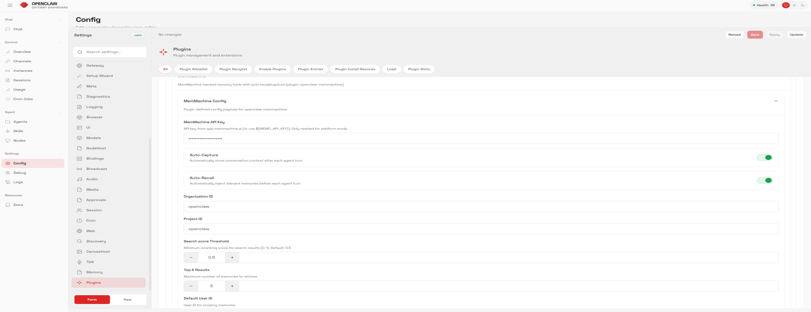

The MemMachine plugin for [OpenClaw](https://github.com/OpenClaw/OpenClaw) provides a queryable long-term memory layer. By storing interaction history and retrieving high-relevance context at inference time, your agents stay grounded while reducing token waste.

<CardGroup cols={2}>
  <Card title="Persistent Memory" icon="brain">
    Maintain context across different agent sessions without ballooning your prompt size.
  </Card>
  <Card title="Auto Recall" icon="bolt">
    Automatically inject relevant episodic and semantic memories before your agent responds.
  </Card>
</CardGroup>

## Features

* **Auto Recall**: Searches memories before the agent responds and injects matches into the context.
* **Auto Capture**: Automatically sends every exchange to MemMachine after the agent responds.
* **Native Functions**: Registers `memory_search`, `memory_store`, `memory_forget`, and `memory_get` directly in OpenClaw.

---

## Setup

<Steps>
  <Step title="Install the Plugin">
    Install the package directly via the OpenClaw CLI:
    ```bash
    openclaw plugins install @memmachine/openclaw-memmachine
    ```
    
    Or, for local development:
    ```bash
    openclaw plugins install ./MemMachine/integrations
    cd ./MemMachine/integrations/openclaw && pnpm install
    ```
  </Step>

  <Step title="Configure Credentials">
    Get an API key from the [MemMachine Cloud](https://console.memmachine.ai). 
    
    You can configure the plugin through the **OpenClaw Gateway Dashboard** under `Settings > Plugins` or by editing your `openclaw.json` file.
  </Step>

  <Step title="Initialize Configuration">
    Add the `openclaw-memmachine` entry to your `plugins.entries` object in `openclaw.json`:

    ```json5
    "openclaw-memmachine": {
      "enabled": true,
      "config": {
        "apiKey": "mm-...",
        "baseUrl": "[https://api.memmachine.ai](https://api.memmachine.ai)",
        "autoCapture": true,
        "autoRecall": true,
        "orgId": "openclaw",
        "projectId": "openclaw",
        "searchThreshold": 0.5,
        "topK": 5,
        "userId": "openclaw"
      }
    }
    ```
  </Step>
</Steps>

---

## UI Configuration

For a no-code approach, use the OpenClaw Gateway Dashboard to toggle features and manage identifiers.



### Configuration Parameters

| Parameter | UI Label | Description |
| :--- | :--- | :--- |
| `apiKey` | MemMachine API Key | Your MemMachine API key from the cloud console. |
| `baseUrl` | Base URL | The MemMachine API base URL (Default: `https://api.memmachine.ai`). |
| `autoCapture` | Auto-Capture | Automatically store conversation context after each agent turn. |
| `autoRecall` | Auto-Recall | Automatically inject relevant memories before each agent turn. |
| `orgId` | Organization ID | Your unique organization identifier. |
| `projectId` | Project ID | Your unique project identifier. |
| `userId` | Default User ID | User identifier used for scoping memories. |
| `searchThreshold` | Search score Threshold | Minimum reranking score for search results (0-1). |
| `topK` | Top K Results | Maximum number of memories to retrieve per turn. |

<Note>
**Pro Tip:** Tuning the **Search score Threshold** is key; a value of `0.5` is a good baseline, but increase it if your agent is recalling loosely related, noisy information.
</Note>

---

## CLI Commands

The plugin registers two CLI functions for manual memory management and debugging:

* `search`: Search MemMachine memory directly from the command line.
* `stats`: Retrieve usage and health statistics from MemMachine.
